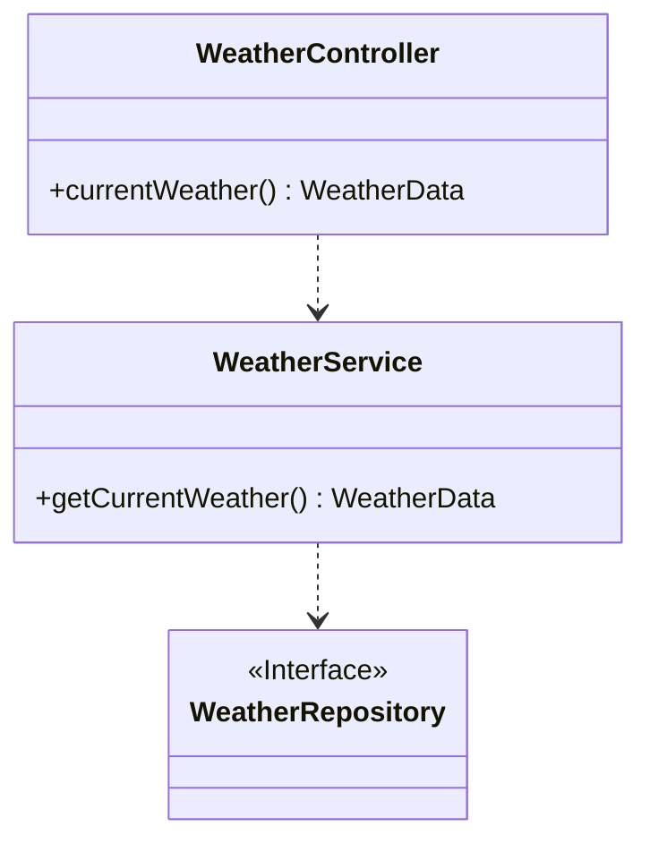
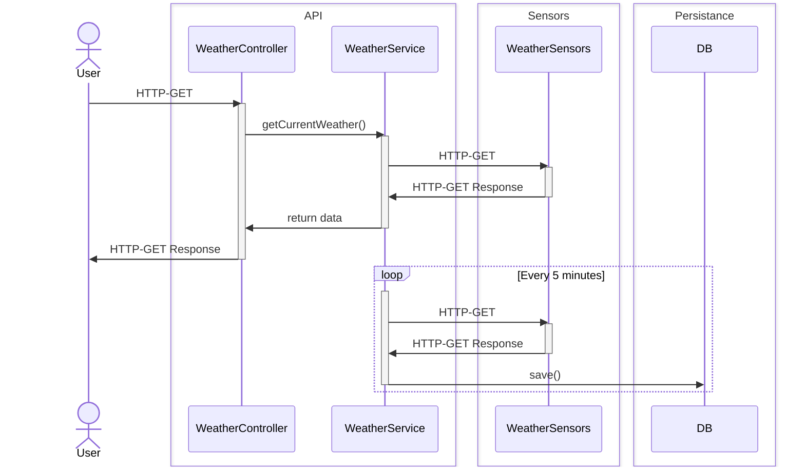

# WeatherStation

WeatherStation is a over engineered server application for home temperature and humidity monitoring.

> This project is used as a playground to try and explore
> different Frameworks, Languages and distributed architectures using docker.

The server
- displays the current temperature and humidity via a REST-API
- collects temperature and humidity data every 5 minutes
- stores this data for future analytics

## Running and using WeatherStation
### Using Docker
1. Copy the docker compose file from this repository.
2. Run `docker compose up`

Images are build to run on a arm7 platform.

## Project Structure

### Class diagram

## Sequence diagram

