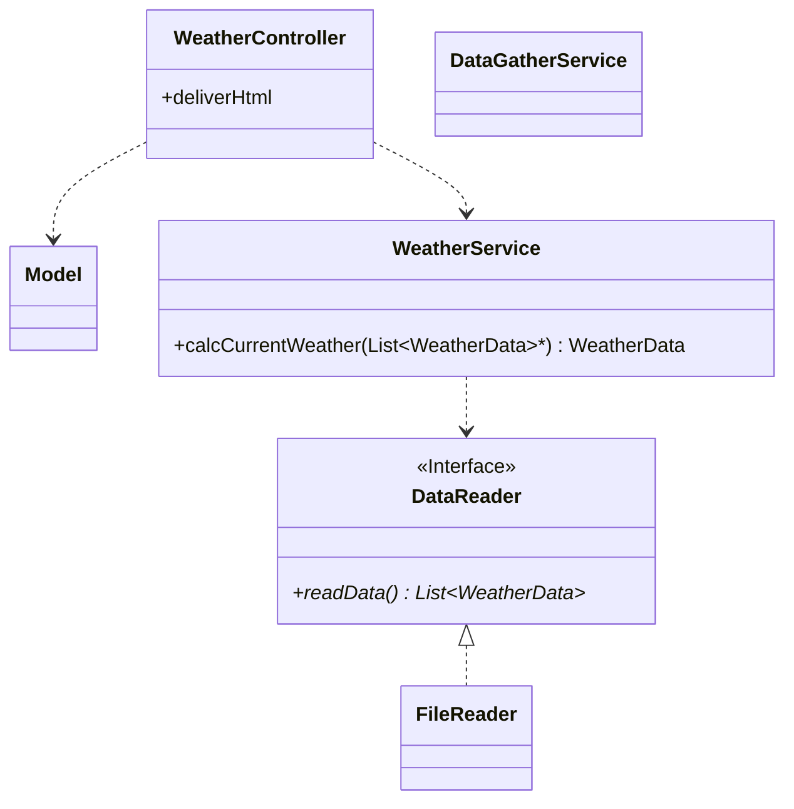
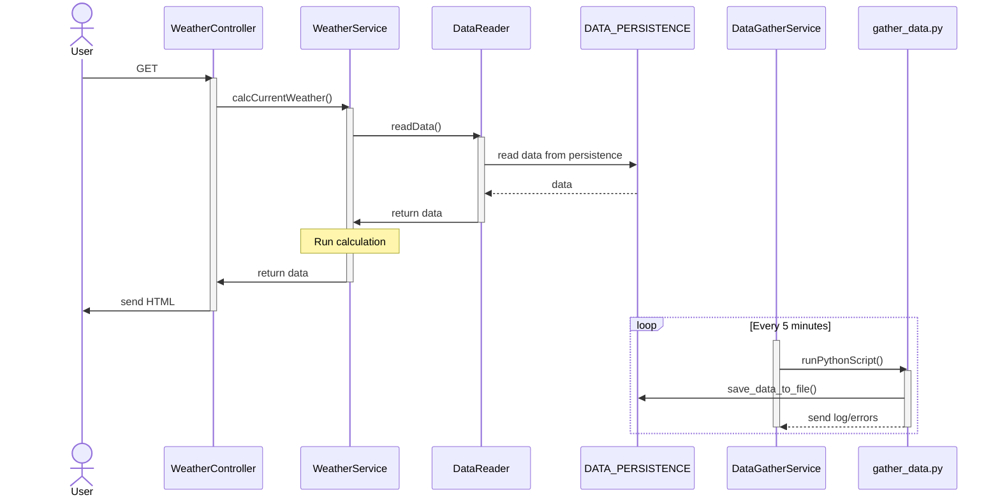

# WeatherStation

WeatherStation is a small server application for home temperature and humidity monitoring.

The server
- displays the current temperature and humidity via a HTML file
- collects temperature and humidity data every 5 minutes
- stores this data for future analytics

> This project is used as a playground to try and practice stuff.

## Running and using WeatherStation
### As JAR 
1. Download the latest release zip from `./releases`
2. Unpack the zip file to desired location. The Folder structure **must** be maintained as:
```
Folder
|-- WeatherStation_vX.X.X.jar
|-- python
|   └-- gather_data.py
└-- data [empty]
 ``` 
3. [Optional] Adjust the gather_data.py file. See comments in file.\
*This python file contains the code to gather environment data and save this data in the ./data folder.
The standard implementation uses a DHT22 sensor and assumes to run on a rasberry pi.*
4. Run the JAR file.
5. Go to `http\\localhost:8080` to see the output.

## Project Structure

### Class diagram


## Sequence diagram



