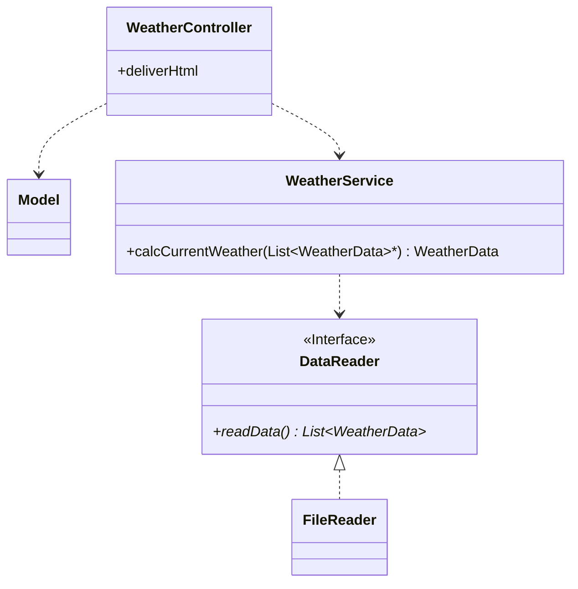

# WeatherStation

Work in Progress

## About
Work in progress

## Project Strucure

```mermaid
classDiagram
    WeatherController ..> Model
    WeatherController ..> WeatherService
    WeatherService ..> DataReader
    DataReader <|.. FileReader

    class WeatherController{
        +deliverHtml
    }

    class WeatherService{
        +calcCurrentWeather(List~WeatherData~*) WeatherData
    }

    class DataReader{
        <<Interface>>
        +readData() List~WeatherData~*
    }

    class FileReader{
    }
```