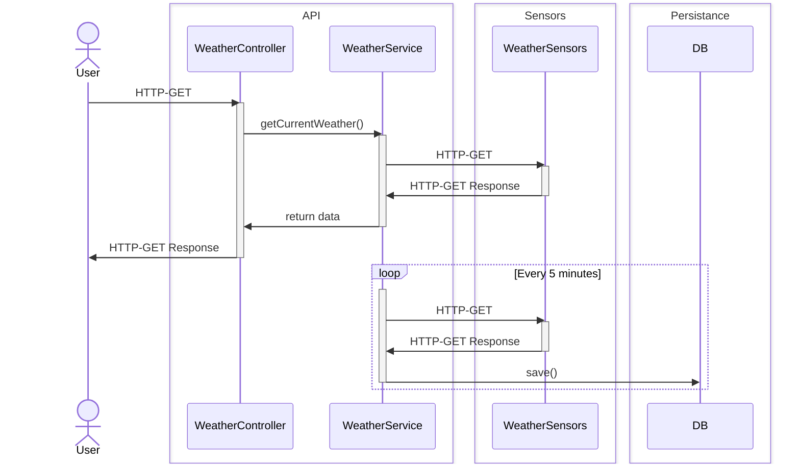
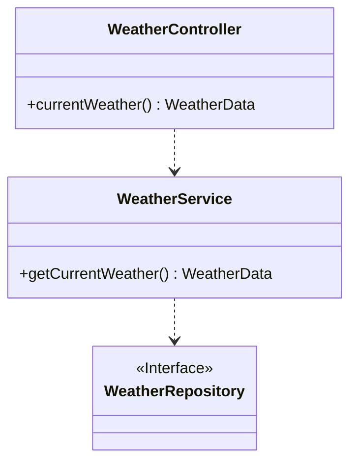

# WeatherStation
WeatherStation is a over-engineered server application for home temperature and humidity monitoring.

> This project is used as a playground to try and explore
> different Frameworks, Languages and distributed architectures using Docker.

The server


## Running and using WeatherStation
### Using docker compose
1. Copy the docker compose file from this repository.
2. Run `docker compose up`

> Images in dockerhub are build to run on a arm7 platform. (Like a Rasberry Pi).

### Manual build
To build this container manually run:
```
./gradlew build bootJar
docker build --platform linux/arm/v7 -t weatherstation:X.X.X .
```

## Project Structure
The project consists of 3 Services, each running in their own Docker container.

**WeatherStation**\
Central API server.
- displays the current temperature and humidity via a REST-API,
- collects temperature and humidity data every 5 minutes from **WeatherSensors**
- and stores this data for future analytics in the **Database**.

**WeatherSensors**\
Microservice for interaction with the DHT-22 sensor.
Exposes a single REST-API. When called, the service reads the current temperature and
humidity and returns them with a timestamp in JSON format.

Repository: https://github.com/weissale1/WeatherSensors


**DB**\
A Postgres Database. Uses the `postgress:latest` image.


## Sequence diagram


## Service Structure

### Class diagram




